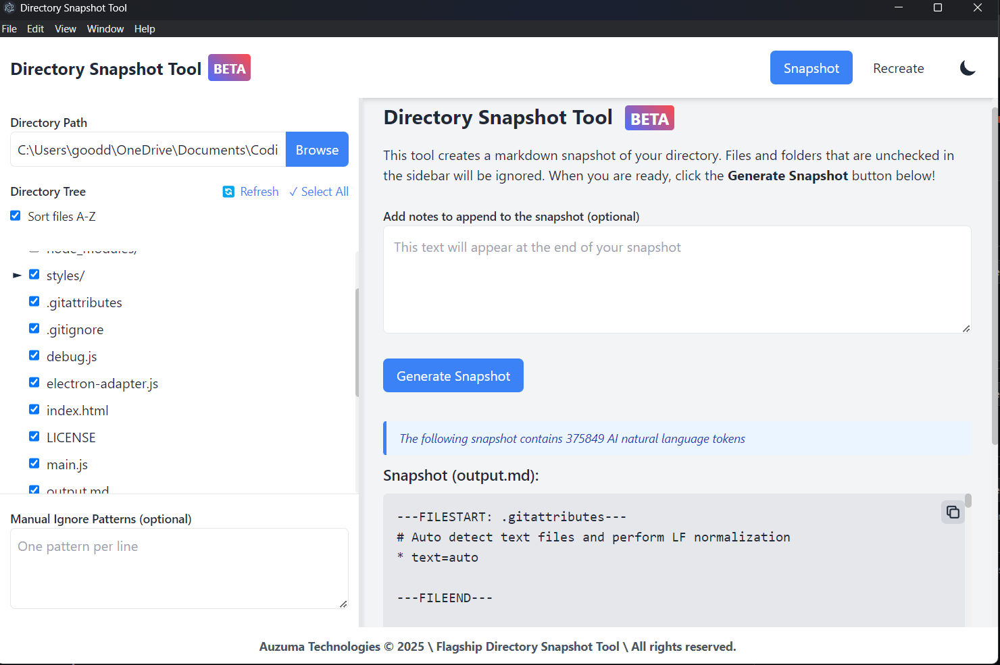

# Flagship Directory Snapshot Tool - **The Ultimate Snapshot App, Built as an Electron Desktop Application**

This is the Electron desktop version of the [Python Directory Snapshot Tool](https://github.com/gooddavvy/Py_markdown-directory-snapshot-special), providing the same functionality as the original Python-based tool but with a native desktop interface, and with **several enhancements and adjustments**.



## Features

- Create snapshots of directory structures and file contents
- Recreate directory structures from snapshots
- Customizable ignore patterns
- Dark/light theme support
- Snapshot token counting for AI model compatibility
- Expandable/collapsable folder structure
- Adjustable sidebar width

## Installation

### Prerequisites

- [Node.js](https://nodejs.org/) (v14 or later)
- [npm](https://www.npmjs.com/) (usually comes with Node.js)
- [python (Optional)](https://www.python.org/downloads/) (only install if you run into issues with `node-gyp`, which requires python)

### Setup

1. Clone the repository:
   ```bash
   git clone https://github.com/auzuma/flagship-directory-snapshot-tool
   cd directory-snapshot-tool
   ```

2. Install dependencies:
   ```bash
   npm install
   ```

3. Run the application:
   ```bash
   npm start
   ```

## Building the Application

To build the application for your platform:

```bash
npm run build
```

This will create an .exe file.

## Usage

### Creating a Snapshot

1. Launch the application
2. Select the "Snapshot" tab (default)
3. Enter a directory path or use the "Browse" button
4. Uncheck any files or folders you want to exclude
5. Add any additional ignore patterns in the "Manual Ignore Patterns" section
6. Click "Generate Snapshot"
7. The snapshot will be displayed and can be copied to clipboard

### Recreating a Directory

1. Launch the application
2. Select the "Recreate" tab
3. Enter the output directory path or use the "Browse" button
4. Paste the snapshot content into the text area
5. Click "Recreate Directory"

## Development

The application is built with:

- ElectronJS - for the desktop application framework
- TailwindCSS - for styling
- Pure JavaScript - for the frontend logic

### Project Structure

- `main.js` - Main Electron process
- `preload.js` - Preload script for secure IPC
- `renderer.js` - Renderer process logic
- `token-counter.js` - Token counter module using OpenAI's `tiktoken`
- `index.html` - Main application UI
- `styles/` - CSS files
- `assets/` - Images and icons

## Development and Contribution

Please let us know (in the [Issues Section](https://github.com/auzuma/flagship-directory-snapshot-tool/issues/new)) if you encounter any issues during setup or usage.

Also, we welcome direct contributions! Please open a pull request to the main branch, and we'd  love to review and merge your changes. Thank you ***so much*** for your support!

## License

This project is licensed under the Apache 2.0 License. See the `LICENSE` file for more information.
